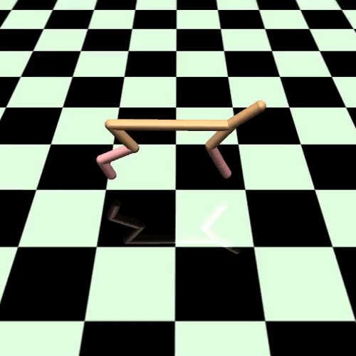
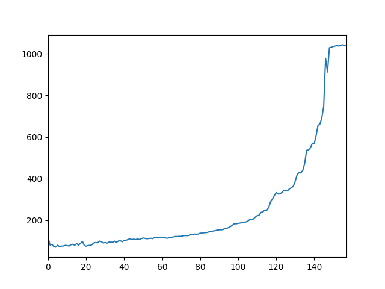
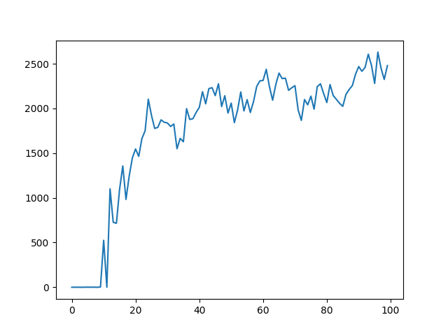

# numpy_ARS
A 150-lines python code for Augmented Random Search (https://arxiv.org/abs/1803.07055) with numpy.

I am definitly impressed by the simplicity and the performance of this algorithm. 
I did not parallelize computations, hence it could be quite less effective than authors' version (https://github.com/modestyachts/ARS).

But my code should be easyer to handle. 

Gif of HalfCheetah after 3min of training on my old i5 core:

Some quick results (1 episode contains 2*n_directions*horizon environment updates):
First 150 episodes with Hopper_V1 [step_size=0.01, noise=0.03, n_directions=8, b=4, seed=1]:

First 100 episodes with HalfCheetah_V1 [step_size=0.02, noise=0.03, n_directions=16, b=16, seed=1]:

